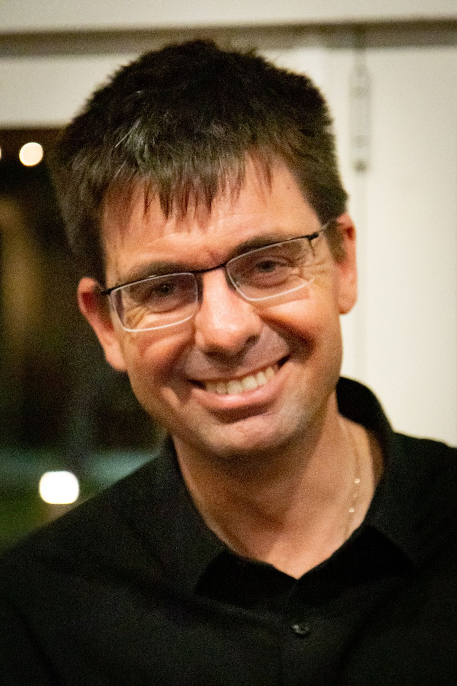
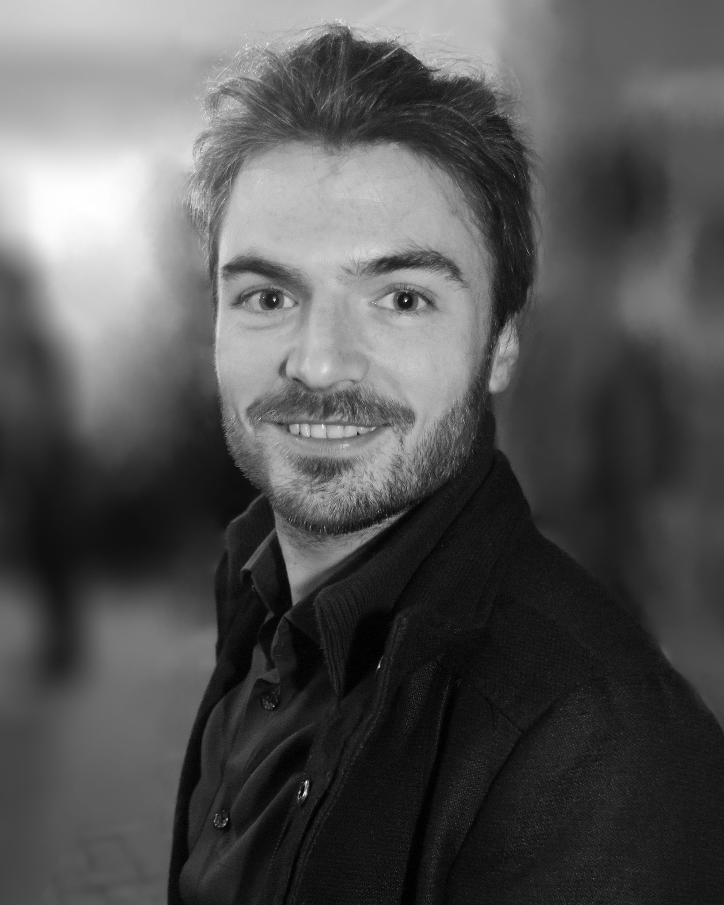
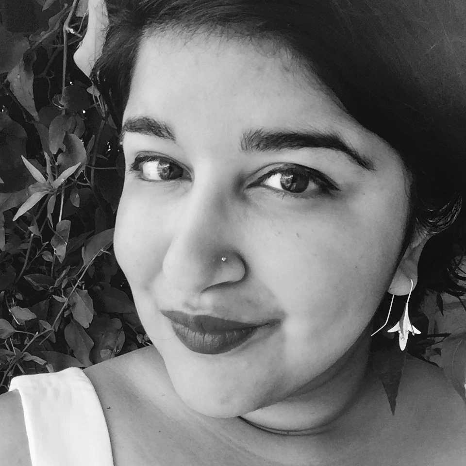
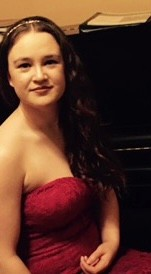
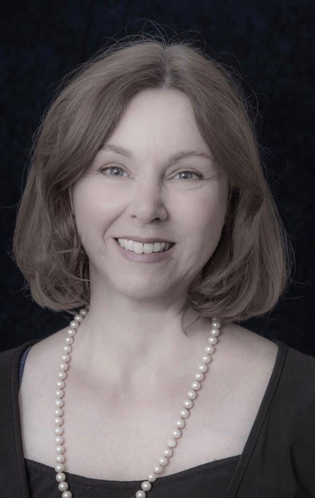

## Peter Kelsall
*Conductor & Musical Director*

Peter Kelsall completed his Bachelor of Music degree in 1989 at Adelaide University studying piano with Zelda Bock. He commenced organ studies with Christa Rumsey in 1987 and completed a Graduate Diploma in Performance on the instrument in 1993. In 1998 he completed his Masters Degree in Music Theory. He also holds a Certificate in Church Music from the Flinders Street School of Music TAFE and has undertaken studies in choral conducting with Carl Crossin.

As an organist Peter has given recitals in the Adelaide Town Hall, St. Peter’s Cathedral, Pilgrim Church and at various locations for the Organ Music Society of Adelaide for which he was a committee member for a number of years. He has played with the Adelaide Symphony Orchestra on many occasions over the last 20 years, including performances of Saint Saens’ ‘Organ’ Symphony, Holst’s Planets, Handel’s Messiah, Mahler’s Symphony no. 2, the 2010 Adelaide Festival performances of Ligeti’s opera Le Grande Macabre, Mahler’s Symphony no. 8 and the 2020  Adelaide Festival performances of Mozart’s Requiem. 

Peter has performed with many Adelaide choirs, including the Adelaide Chamber Singers, Syntony, Adelaide Philharmonia Chorus, Graduate Singers, Corinthian Singers, Elder Conservatorium Chorale, Kapelle Singers and the Adelaide and Flinders Universities Choral Societies.

In 1995 he was appointed Organist and Choir Director at Pilgrim Uniting Church in the city where he continues to build on this church’s strong musical tradition. In the mid 2000s Pilgrim established a tradition of ‘importing’ some of the world’s best organists to Adelaide to play for services and to give recitals on the church’s organ (South Australia’s largest). As a result of this initiative Peter has had the opportunity in recent years to work with highly distinguished organists including Thomas Trotter, David Goode, Benjamin Bayl, Benjamin Sheen, Clive Driskill-Smith, Simon Preston, John Scott, Daniel Roth and Olivier Latry.

In December 2017 and January 2018 Peter directed the Choirs of Pilgrim Church and Christ Church North Adelaide on their English Cathedrals Tour. The Choirs sang Evensongs in some 10 English cathedrals, including Lincoln, Durham, Salisbury, Winchester, Gloucester and York Minster. He will be conducting the Choir of Pilgrim Church on a further tour of the UK in 2022/23.

An honorary life member of the Adelaide University Choral Society, he has been their Musical Director since 1997. With AUCS he has conducted a wide range of repertoire, from Palestrina to Pink Floyd and most things in between. In January 2019 Peter directed the acclaimed ‘Northern Lights’ concert for the Australian Intervarsity Choral Festival held in Adelaide.

Peter is in demand as an accompanist and has been associated with a number of choirs in this capacity. He also teaches piano, organ, and music theory and works as an accompanist and music tutor at Walford Anglican School.

## Andrew Moschou
*Organist*

Andrew is a semi-professional musician with a background in piano, cello and orchestral music, having become an Associate of Music Australia (AMusA) in 2009. Since then, his musical focus migrated towards choral music, performing as a chorister with AUCS and the Graduate Singers of Adelaide as well as directing and conducting community groups including the Anglican Parish of Lockleys and the Flinders University Choral Society. In non-musician life, he is a teacher at Hamilton Secondary College where he is involved in Space education and outreach programmes.

## Riana Chakravarti
*Alto*

An experienced solo and ensemble singer, Riana Chakravarti is an inaugural member of ACS², and has performed with Adelaide Chamber Singers, Graduate Singers, Adelaide Hills Chamber Players, and many other choirs. They have been a Pilgrim Uniting Church choral scholar since 2015.

Recent performance highlights include solo and chorus participation in the world premiere of *Watershed: The Death of Dr Duncan* in Adelaide Festival 2022, chorus in *Requiem* in Adelaide Festival 2020, solo and ensemble singing in the 2019 Australian premiere of *Considering Matthew Shepard*, and solos for Norwood Symphony Orchestra (Mendelssohn’s *Elijah*) and Adelaide University Choral Society (Dvořák’s *Stabat Mater*).

Riana is looking forward to a busy winter performing in a series of concerts with Adelaide Hills Chamber Players, singing chorus in Mopoke Productions’ upcoming performances of Puccini’s *Suor Angelica*, and singing the contralto solos in Purcell’s *Hail, bright Cecilia* with Adelaide Harmony Choir.

In their spare time, Riana is an arts administrator for Adelaide Choral Network and Adelaide Symphony Orchestra. They are delighted to sing solo once again for AUCS, a group that nurtured their love of choral singing for many years.

## Megan Fishers
*Soprano*

Having completed in 2016 a Bachelor of Classical Performance, Voice at the Elder Conservatorium under the tuition of Rosalind Martin, Megan has performed extensively, both as a chorister and soloist. Megan has worked with many choirs in Adelaide, including Adelaide Chamber Singers, Chorale, and Kapelle Singers. Currently she holds the Soprano Lay Clark position at Christ Church North Adelaide.

## Suzanne Pederson
*Soprano*

Suzanne was a Special Music student at Brighton High School before gaining a B Mus (Perf) (Hons) at the Elder Conservatorium of Music under Jiri Tancibudek in 1987.  After a time as an oboist—ad hoc with Adelaide Symphony Orchestra, the State Opera Orchestra of SA and full-time with the Band of the South Australia Police—during which she also sang with Adelaide Chamber Singers, Corinthian Singers and Graduate Singers, Suzanne left Adelaide in 1991 to forge a career as a choral and Early Music specialist soprano in London. 
 
She has sung with professional ensembles Steve Reich and Musicians (with Synergy Vocals), the BBC Singers, The Sixteen, The King’s Consort, Gabrieli Consort and Philharmonia Voices. Her voice is on many film and video game soundtracks, including several in the Harry Potter series; and she appeared on screen in series 1 of *Call the Midwife*.
 
As a professional chorister, Suzanne has sung with Westminster Abbey Special Service Choir, St Paul’s Cathedral Consort and the choirs of Westminster Cathedral, St Margaret’s Westminster, St Bride’s Fleet Street, London Oratory and St George’s Hanover Square (Handel’s church), amongst numerous other London churches.  She was Cantor at St Mary-le-Bow, where she performed Bach cantatas in a liturgical context. 
 
Suzanne returned to Adelaide in March 2020 to be with her family during the Covid-19 pandemic, and has decided to stay.
